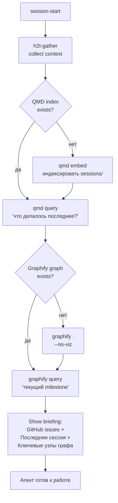
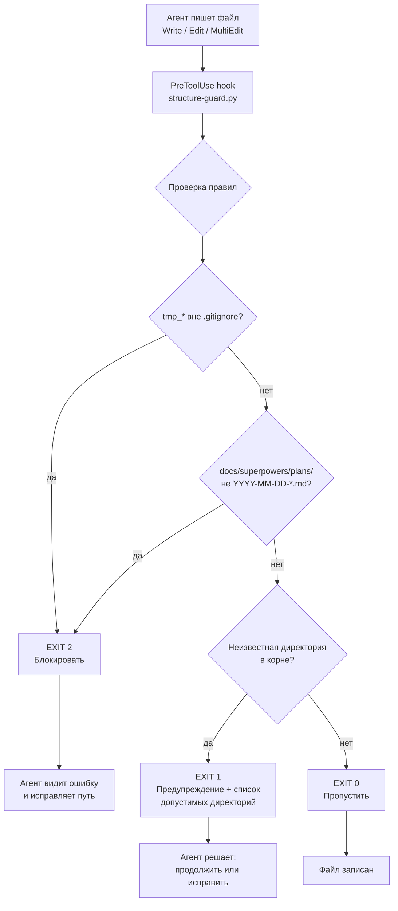
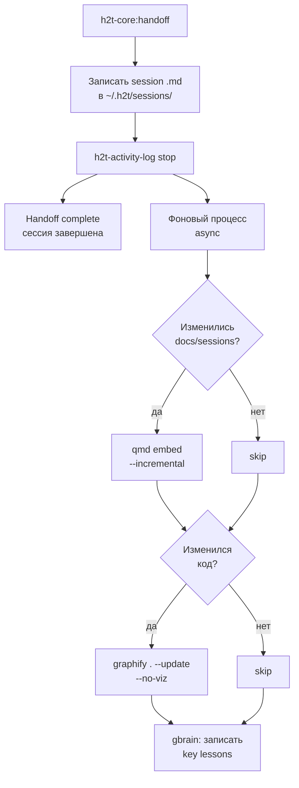
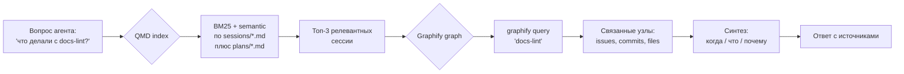
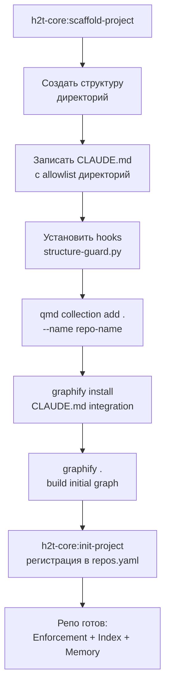
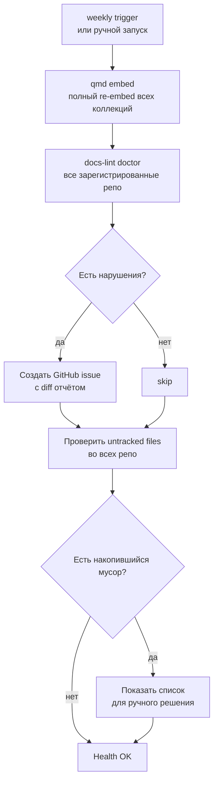
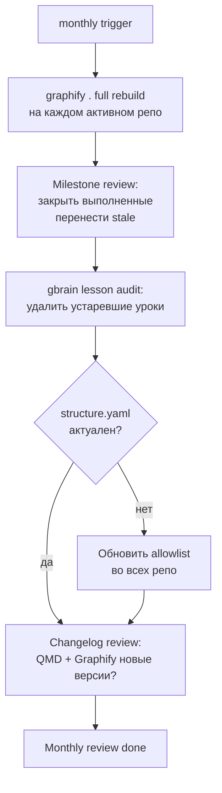

# Lifecycle OS v2 — Unified Agent Workspace

## Проблема

С января 2026 года строится инфраструктура для управления AI-агентами
в нескольких репозиториях. За 6 месяцев выявлены три системных сбоя:

1. **Структурный хаос** — агенты создают файлы где попало, выдумывают
   имена директорий. docs-lint находит хаос постфактум — после того,
   как он уже создан. 70% правил CLAUDE.md соблюдается, 30% — нет.

2. **Амнезия между сессиями** — каждая сессия начинается без контекста.
   Повторяются одни и те же ошибки. Re-establishing context через
   перечитывание файлов стоит тысячи токенов.

3. **Дезориентация в кодовой базе** — агент не знает где что лежит,
   создаёт дубликаты, нарушает конвенции не из злого умысла, а просто
   не имея карты.

Ключевой вывод из research: это **архитектурная** проблема, не проблема
правил. Reactive validation (docs-lint) не работает — нужны preventive
механизмы, работающие до записи файла.

---

## Стек решений

| Уровень | Инструмент | Звёзды | Роль |
|---|---|---|---|
| Enforcement | PreToolUse hook | — | Блокирует нарушения до Write |
| Ориентация | Graphify | 66K | Knowledge graph проекта |
| Поиск по истории | QMD | 26K | BM25 + semantic по docs/sessions |
| Память / уроки | gbrain (gstack) | — | Lessons learned, cross-session |
| Project tracking | spool + GitHub Issues | — | Уже существует |

> **Node.js исключение:** QMD требует npm/bun. Принцип "no Node.js" применяется
> к production-зависимостям и серверному коду — не к внешнему dev tooling
> (аналогично gh CLI, git, draw.io Desktop).

---

## Процесс 1: Session Start — Ориентация агента

Цель: агент начинает сессию с полным контекстом за < 30 секунд.



---

## Процесс 2: Work Loop — Enforcement в реальном времени

Цель: агент не может создать файл с нарушением структуры.



**Правила (реестр):**

| Паттерн | Действие | Сообщение |
|---|---|---|
| `tmp_*`, `*_tmp.*`, `*_v2.*` | BLOCK | "Запрещённый паттерн имени" |
| `docs/superpowers/plans/[^0-9]` | BLOCK | "Формат: YYYY-MM-DD-*.md" |
| Новая dir в корне, не в allowlist | WARN | "Список допустимых: plugins/ docs/ h2t_ops/ ..." |
| `.env`, `*.secret` | BLOCK | "Секреты не коммитятся" |

---

## Процесс 3: Session End — Handoff + Обновление индексов

Цель: после сессии память обновляется автоматически.



---

## Процесс 4: Cross-Session Memory Query

Цель: агент находит ответ "что мы делали с X" за секунды без перечитывания файлов.



---

## Процесс 5: Bootstrapping нового репозитория

Цель: новый репо получает всю инфраструктуру за одну команду.



---

## Процесс 6: Regular Maintenance — Гигиена и перепланирование

Цель: инфраструктура не деградирует со временем даже при активной работе агентов.

### Триггеры и действия

| Триггер | Действия |
|---|---|
| Каждый handoff | `qmd embed --incremental`, `graphify . --update --no-viz` |
| Раз в неделю | `qmd embed` (полный), docs-lint audit по всем репо |
| Раз в месяц | `graphify .` (full rebuild), milestone review, gbrain lesson pruning |
| Новый репо | Bootstrap (процесс 5) |
| Изменение конвенций | Обновить `structure.yaml` + `CLAUDE.md` во всех репо |

### Диаграмма weekly maintenance



### Диаграмма monthly review



### Мониторинг здоровья инфраструктуры

Признаки деградации, которые нужно отлавливать:

| Симптом | Диагноз | Действие |
|---|---|---|
| docs-lint говорит "organic" | structure-guard хук не установлен или отключён | Переустановить хук |
| QMD не находит старые сессии | Коллекция не проиндексирована > 2 недель | `qmd embed` |
| Graphify граф не содержит новых файлов | `--update` не запускался при handoff | Проверить handoff hook |
| gbrain lessons > 100 записей | Накопился шум, нет pruning | Monthly review |
| Untracked files растут несмотря на хук | Хук пропускает edge cases | Обновить правила в `structure.yaml` |

---

## Компоненты и их ответственность

### structure-guard.py (новый)

**Где:** `plugins/h2t-core/hooks/structure-guard.py`
**Распределение:** Через h2t-core plugin — активен автоматически во всех сессиях
после `/plugin marketplace update lichtpfad` + `/reload-plugins`. Не требует
per-repo установки.
**Когда:** PreToolUse на Write/Edit/MultiEdit
**Что делает:**
- Читает allowlist директорий из `.h2t/structure.yaml` текущего репо
- Проверяет имя файла по реестру запрещённых паттернов
- EXIT 2 (block) — нарушение naming convention
- EXIT 1 (warn) — новая директория, не в allowlist
- EXIT 0 — разрешить

**Конфигурация (`.h2t/structure.yaml`):**
```yaml
allowed_root_dirs:
  - plugins/
  - docs/
  - h2t_ops/
  - lib/
  - scripts/
  - tests/

forbidden_patterns:
  - "tmp_*"
  - "*_tmp.*"
  - "*_v2.*"
  - "*_copy.*"
  - "*_backup.*"

plan_dirs:
  - path: "docs/superpowers/plans/"
    pattern: "^\\d{4}-\\d{2}-\\d{2}-.+\\.md$"
```

### QMD Collections (конфигурация)

```bash
# Запускается один раз при bootstrap
qmd collection add ~/.h2t/sessions --name sessions
qmd collection add ~/dev/h2t-skills/docs --name h2t-skills-docs
qmd context add qmd://sessions "Архив рабочих сессий и handoff-файлов"
qmd context add qmd://h2t-skills-docs "Документация проекта h2t-skills"
qmd embed
```

### Graphify Integration

```bash
# Bootstrap: один раз
graphify install  # пишет hook в .claude/settings.json
graphify .        # строит начальный граф

# Handoff: автоматически
graphify . --update --no-viz
```

---

## Что НЕ входит в v2

- LLM-advisory mode в docs-lint (#258) — отдельный тикет
- Greptile / Cody — избыточны для solo workflow
- Централизованный POS / database — преждевременно
- Автоматическое исправление нарушений — агент должен решать сам

---

## Решённые архитектурные вопросы

| Вопрос | Решение |
|---|---|
| structure.yaml — per-repo или platform? | **Per-repo** (`.h2t/structure.yaml`), создаётся scaffold |
| Handoff indexing — sync или async? | **Async** — фоновый процесс, handoff не блокируется |
| hook distribution | **h2t-core plugin** — автоматически, без per-repo bootstrap |
| QMD Node.js — нарушение принципа? | **Исключение** — внешний dev tooling, не production зависимость |

## Open Questions

1. **Graphify graph size** — при 6+ repos нужен ли кросс-репо граф или per-repo достаточно?
2. **gbrain sync** — когда gbrain пишет lesson: в конце каждой сессии или только при явном `lesson:` маркере?
3. **Monthly review trigger** — ручной запуск или `/schedule`?
4. **Graphify timeout** — что делает handoff если graphify не установлен или висит?

---

## Тесты для structure-guard.py

Минимальный тест-план до merge:

| Сценарий | Ожидаемый EXIT |
|---|---|
| Write `tmp_foo.txt` | EXIT 2 (block) |
| Write `docs/superpowers/plans/foo.md` (без даты) | EXIT 2 (block) |
| Write `docs/superpowers/plans/2026-06-14-foo.md` | EXIT 0 (allow) |
| Write `plugins/h2t-core/foo.py` | EXIT 0 (allow) |
| Write `random_new_dir/foo.py` (не в allowlist) | EXIT 1 (warn) |
| `.h2t/structure.yaml` отсутствует | EXIT 0 (fail open, не блокировать) |

## Следующие шаги

1. Нарисовать draw.io диаграмму всего стека
2. Написать implementation plan (superpowers:writing-plans)
3. Реализовать structure-guard.py (< 100 строк) + тесты
4. Bootstrap QMD + Graphify в h2t-skills
5. Обновить h2t-core:scaffold-project (добавить `.h2t/structure.yaml` в scaffold)
