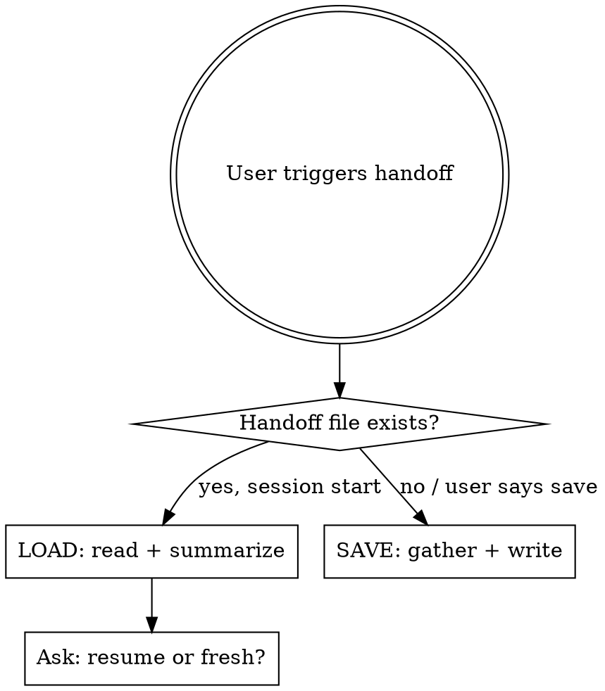

# Session Handoff

Save and restore development status between sessions.

## Two Modes



**SAVE** = end of session. **LOAD** = start of session.
If user explicitly says "save" or "handoff" mid-session, always SAVE.

## SAVE Procedure

### 1. Gather facts (DO NOT HALLUCINATE)

**CRITICAL: Only write what you can verify.** Run these commands:

```bash
git branch --show-current          # current branch
git log --oneline -1               # last commit
git status --short                 # uncommitted changes
```

**Scope:** "What Was Done" and "Files Changed" describe THIS SESSION only, not previous sessions. Use conversation context, not `git diff HEAD~N` which may include older commits.

Read the TodoWrite task list if it exists. Check for open tasks.

### 2. Check for project template

Look for `handoff_template.md` in project root or `configs/` directory. If found, use that format instead of the default below.

### 3. Write handoff file

**Location:** Project auto memory directory: `<memory_dir>/handoff.md`
(The memory directory path is in your system prompt under "auto memory directory")

**Default format (keep under 80 lines):**

```markdown
# Handoff — YYYY-MM-DD

## Branch & Commit
- **Branch:** <from git>
- **Last commit:** <hash> <message>
- **Uncommitted:** <yes/no, list if yes>

## What Was Done
- <completed item 1>
- <completed item 2>

## What Remains
- [ ] <next task 1>
- [ ] <next task 2>

## Key Decisions
- <decision>: <rationale> (see <file>)

## Blockers / Open Questions
- <blocker or question>

## Files Changed
- <path> — <what changed>

## Critical Context
<anything the next session MUST know to avoid mistakes>
```

### Rules

- **Max 80 lines.** Handoff is a summary, not a journal. If you need 80+ lines, you're over-explaining.
- **No duplication.** Don't repeat what's already in CLAUDE.md or MEMORY.md (project constraints, conventions, architecture overview). Just reference: "See CLAUDE.md for project conventions."
- **Verify before writing.** Every file path, commit hash, and config value must come from a tool call (Read, Bash, Glob). Never write a value from memory alone. When describing decisions or changes, use precise wording from the actual files, not paraphrases that may lose nuance.
- **Uncommitted work is critical.** If `git status` shows changes, list every modified file. The next session needs to know what's in-flight.
- **Remaining tasks are actionable.** Each "What Remains" item should be specific enough to start immediately, not vague ("continue work").

## LOAD Procedure

### 1. Read handoff file

Read `<memory_dir>/handoff.md`. If it doesn't exist, tell the user — no handoff available.

### 2. Verify current state

```bash
git branch --show-current
git log --oneline -1
git status --short
```

Compare with handoff. Flag discrepancies:
- Different branch? Someone switched.
- Different last commit? Work happened between sessions.
- Uncommitted changes not in handoff? New work or stale handoff.

### 3. Present summary

Show the user:
- What was done last session
- What remains
- Any discrepancies between handoff and current git state
- Ask: "Continue with remaining tasks, or different direction?"

### 4. Create tasks

If user wants to continue, create TodoWrite tasks from "What Remains" list.

## Common Mistakes

| Mistake | Fix |
|---------|-----|
| Writing config values from memory | Run `Read` on the actual file first |
| 200+ line handoff | Cut to 80. Reference docs, don't repeat them |
| Vague remaining tasks ("update things") | Be specific: "Update architecture_full.mermaid: add AVAIL→KillSwitch edge" |
| Missing uncommitted changes | Always run `git status` before SAVE |
| Overwriting previous handoff without reading | Read existing handoff first, merge if needed |
| Including work from previous sessions | "What Was Done" = this session only. Use conversation context, not git log |
