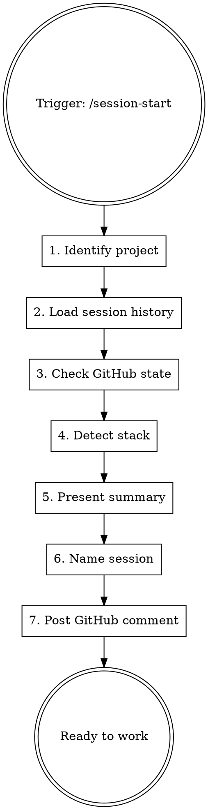

# Dev Session Start

Load project context, show active work across sessions, and prepare for focused development.

**Paired with:** `h2t:handoff` (SAVE at end) — this skill is LOAD at start.

## When to Use

- Starting a new coding/product session
- Resuming work after a break
- Switching to a different project

**NOT for:** personal OS, management, psychology, non-dev conversations.

## Procedure



### Step 1: Identify Project

```bash
git remote get-url origin 2>/dev/null   # → repo name
git branch --show-current               # → current branch
git log --oneline -5                    # → recent commits
git status --short                      # → uncommitted work
```

Extract `owner/repo` from remote URL for `gh` commands.

### Step 2: Load Session Context (NOT task list)

Determine repo name, then read session files for this repo across ALL machines:

```bash
REPO=$(basename "$(git remote get-url origin 2>/dev/null)" .git 2>/dev/null || basename "$(pwd)")
ls ~/.dor/sessions/*/"$REPO"/*.md 2>/dev/null
```

**Extract from handoff files — CONTEXT ONLY:**
- Key Decisions and rationale
- Critical Context / подводные камни
- Uncommitted work (modified files not yet committed)
- Which machine last worked on what branch

**Do NOT use from handoff files:**
- "What Remains" task lists — these are stale snapshots. GitHub issues are the truth.

Also read `<memory_dir>/MEMORY.md` for stable lessons.

Legacy fallback (in order):
1. `<memory_dir>/sessions/*.md` — old repo-local format, migrate on next handoff
2. `<memory_dir>/handoff.md` — very old single-file format

If none exist (first session ever), skip to Step 3 — there's no history yet.

### Step 3: Check GitHub State

Extract `{owner}/{repo}` from Step 1 remote URL.

**Project filter:** if `.claude/project-id` exists in current directory, filter issues by that project label:

```bash
PROJECT_LABEL=""
if [ -f ".claude/project-id" ]; then
  PID=$(tr -d '[:space:]' < .claude/project-id)
  [ -n "$PID" ] && PROJECT_LABEL="--label project:$PID"
fi
```

Run in parallel:

```bash
gh api repos/{owner}/{repo}/milestones --jq '.[] | select(.state=="open") | {title, open_issues}'
gh issue list --state open $PROJECT_LABEL --json number,title,labels --limit 20
gh issue list --state open --label "bug" $PROJECT_LABEL --json number,title --limit 10
gh pr list --state open --json number,title,headRefName
```

If `PROJECT_LABEL` is set — show only project-scoped issues. Mention scope in summary header:
`## 🔧 Project: {repo-name}/{project-id} ({branch})`

If no `.claude/project-id` — show all open issues (repo-wide scope).

Pick the milestone with most open issues as "current". Then load its tasks:

```bash
gh issue list --milestone "<current milestone title>" --state open $PROJECT_LABEL --json number,title,labels
```

### Step 4: Detect Stack

Auto-detect from project files:

| File | Stack |
|------|-------|
| `package.json` | JS/TS → `npm test`, `npm audit`, `npm run build` |
| `pyproject.toml` | Python → `pytest`, `pip-audit`, `ruff check` |
| `Cargo.toml` | Rust → `cargo test`, `cargo audit`, `cargo clippy` |
| `go.mod` | Go → `go test`, `govulncheck` |

Check CLAUDE.md for `## Stack Config` override section. If present, use those commands instead.

### Step 5: Present Summary

GitHub is the source of truth for tasks. Handoff provides supplementary context only.

```markdown
## 🔧 Project: {repo-name} ({branch})

**Stack:** {detected stack}
**Milestone:** {current milestone} — {open}/{total} issues

### Open Tasks (from GitHub)
- P0: #38 Add blockType field, #39 technology field...
- P1: #41 Markdown preview...
- Bugs: #43 selection lost, #44 glow lost

### Uncommitted Work
{git status output if any — from Step 1}

### Open PRs
{pr list if any}

### ⚠️ Context from last session
{key decisions, approaches tried, critical gotchas — from handoff files ONLY}
{machine: {machine-name}, branch: {branch}, date: {date}}
```

**Rules:**
- Task list = open GitHub issues only. Never copy "What Remains" from handoff as tasks.
- If handoff mentions an issue that is now CLOSED → omit it entirely.
- Context section is optional — only include if there are non-obvious decisions or gotchas.

Ask: **"Продолжить с задачей X, или другое направление?"**

### Step 6: Name Session

Session slug template:

```
{project}-{milestone}-{layer-task}-{date}-{starttime}
```

| Segment | Format | Example |
|---------|--------|---------|
| `project` | short repo name | `crypto` |
| `milestone` | milestone prefix | `m4` |
| `layer-task` | layer + task type | `l10-annotations` |
| `date` | YYYY-MM-DD | `2026-03-13` |
| `starttime` | HHMM (24h local) | `1430` |

Full example: `crypto-m4-l10-annotations-2026-03-13-1430`

If no milestone applies (e.g. cross-cutting fix), omit it:
`crypto-annotation-fix-l7-l9-2026-03-13-1015`

Propose to user:

```
Предлагаю имя сессии: `crypto-m4-l10-annotations-2026-03-13-1430` (из issue #21)
Корректируй если нужно.
```

User confirms or edits. Store as `SESSION_NAME` for this conversation.

### Step 7: Post GitHub Comment + Record Session

If working on a specific issue:

```bash
# Get session ID from newest jsonl file
SESSION_ID=$(basename $(ls -t ~/.claude/projects/*/$(basename $(pwd))/*.jsonl 2>/dev/null | head -1) .jsonl 2>/dev/null)

gh issue comment {NUMBER} --body "🤖 Session: {SESSION_NAME}-{DATE}
Resume: claude --resume ${SESSION_ID}
Handoff: memory/sessions/{SESSION_NAME}-{DATE}.md"
```

Create TodoWrite tasks from chosen work items.

### Step 7.5: Register Session in Registry

Extract session ID from current .jsonl file, then append + update registry:

```bash
REGISTRY_PY="$HOME/.h2t/config/registry/registry.py"
[ ! -f "$REGISTRY_PY" ] && REGISTRY_PY="/c/dev/config/registry/registry.py"

# Cross-platform h2t venv detection
H2T_PYTHON="${H2T_PYTHON:-}"
if [ -z "$H2T_PYTHON" ]; then
  [ -f "$HOME/.h2t/venv/bin/python" ] && H2T_PYTHON="$HOME/.h2t/venv/bin/python"
  [ -f "$HOME/.h2t/venv/Scripts/python.exe" ] && H2T_PYTHON="$HOME/.h2t/venv/Scripts/python.exe"
fi
[ -z "$H2T_PYTHON" ] && H2T_PYTHON="python3"

MEMORY_DIR="<memory_dir>"
PROJECT_DIR=$(dirname "$MEMORY_DIR")
SESSION_ID=$(basename $(ls -t "$PROJECT_DIR"/*.jsonl 2>/dev/null | head -1) .jsonl 2>/dev/null)
MACHINE="${DOR_MACHINE_NAME:-$(hostname | tr '[:upper:]' '[:lower:]' | cut -d. -f1)}"

if [ -f "$REGISTRY_PY" ] && [ -n "$SESSION_ID" ]; then
  $H2T_PYTHON "$REGISTRY_PY" append --id "$SESSION_ID" --cwd "$(pwd)" --host "$MACHINE"
  $H2T_PYTHON "$REGISTRY_PY" update \
    --id "$SESSION_ID" \
    --status "active" \
    --session-name "{SESSION_NAME}" \
    --topic "{user-provided topic}" \
    --task-issue "#{NUMBER}" \
    --task-title "{issue title}"
fi
```

If registry.py not found or no .jsonl exists, skip silently.

## Session ID Extraction

The Claude session ID is the filename (without `.jsonl`) of the newest transcript in the project memory directory:

```bash
# Find the project memory dir (shown in system prompt as "auto memory directory")
# Then go up one level to find .jsonl files:
MEMORY_DIR="<memory_dir>"  # from system prompt
PROJECT_DIR=$(dirname "$MEMORY_DIR")
SESSION_ID=$(basename $(ls -t "$PROJECT_DIR"/*.jsonl 2>/dev/null | head -1) .jsonl 2>/dev/null)
```

If no `.jsonl` files found (e.g., first session), skip session ID — note this in the GitHub comment.

Use this for `claude --resume {session-id}` references.

## Stack Config Override (in project CLAUDE.md)

If auto-detect is insufficient, project CLAUDE.md can contain:

```markdown
## Stack Config
- test: npx playwright test
- build: npm run build
- audit: npm audit
- lint: eslint .
```

Skill reads this section and uses these commands for pre-merge checks and verification.

## Common Mistakes

| Mistake | Fix |
|---------|-----|
| Skip reading session history | ALWAYS read `sessions/` dir — for context, not for task lists |
| Trust handoff "What Remains" as task list | Use GitHub open issues — handoff is a stale snapshot |
| Show closed issues as tasks | Cross-check handoff mentions against GitHub — closed = omit |
| Forget to post GitHub comment | Traceability is lost — always post session start comment |
| Assume single active session | User may have 2-3 parallel sessions — show ALL active work |
| Hardcode JS commands for Python project | Auto-detect stack first, or read Stack Config |
| Start coding without naming session | Name first — handoff file path depends on it |
| Guess session ID | Extract from actual jsonl file path, never fabricate |
