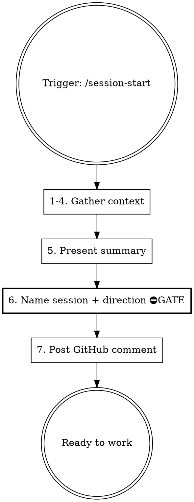

# Dev Session Start

Load project context, show active work across sessions, and prepare for focused development.

**Paired with:** `h2t:handoff` (SAVE at end) — this skill is LOAD at start.

## When to Use

- Starting a new coding/product session
- Resuming work after a break
- Switching to a different project

**NOT for:** personal OS, management, psychology, non-dev conversations.

## Procedure



### Steps 1–4: Gather Context (auto-collected)

**Gathered context:**

!`H2T_PYTHON="${H2T_PYTHON:-}"; [ -z "$H2T_PYTHON" ] && [ -f "$HOME/.h2t/venv/Scripts/python.exe" ] && H2T_PYTHON="$HOME/.h2t/venv/Scripts/python.exe"; [ -z "$H2T_PYTHON" ] && [ -f "$HOME/.h2t/venv/bin/python" ] && H2T_PYTHON="$HOME/.h2t/venv/bin/python"; [ -z "$H2T_PYTHON" ] && H2T_PYTHON="python3"; $H2T_PYTHON "${CLAUDE_PLUGIN_ROOT}/skills/dev-session-start/gather.py" --cwd "$(pwd)" 2>/dev/null || echo '{"error": "gather.py failed"}'`

The JSON above contains all project context:
- `project` — identity (domain, type, github remote) from any directory
- `user` — about-me context paths (core.md + domain-dependent deep paths)
- `git` — branch, status, log, stash (if git repo)
- `github` — issues, milestones, PRs, bugs (if github remote exists)
- `stack` — detected stack and commands
- `sessions` — handoff file paths across all machines
- `session_id` — Claude session ID for resume
- `machine` — hostname

Use this data for Step 5 presentation. Do NOT run git/gh commands to re-collect it.

**After gather, also:**
- Read session handoff files listed in `result.sessions[]` — extract Key Decisions and Critical Context only (NOT task lists)
- Read `<memory_dir>/MEMORY.md` for stable lessons
- Read `result.user.core_path` if it exists — user context for the session

Check CLAUDE.md for `## Stack Config` override section. If present, use those commands instead of `result.stack.commands`.

### Step 5: Present Summary

GitHub is the source of truth for tasks. Handoff provides supplementary context only.

```markdown
## 🔧 Project: {repo-name} ({branch})

**Stack:** {detected stack}
**Milestone:** {current milestone} — {open}/{total} issues

### Open Tasks (from GitHub)
- P0: #38 Add blockType field, #39 technology field...
- P1: #41 Markdown preview...
- Bugs: #43 selection lost, #44 glow lost

### Uncommitted Work
{git status output if any — from Step 1}

### Open PRs
{pr list if any}

### ⚠️ Context from last session
{key decisions, approaches tried, critical gotchas — from handoff files ONLY}
{machine: {machine-name}, branch: {branch}, date: {date}}
```

**Rules:**
- Task list = open GitHub issues only. Never copy "What Remains" from handoff as tasks.
- If handoff mentions an issue that is now CLOSED → omit it entirely.
- Context section is optional — only include if there are non-obvious decisions or gotchas.

**Do NOT ask the user any questions in Step 5.** Step 5 is pure data presentation. All user interaction happens in Step 6.

### Step 6: Name Session + Choose Direction

⛔ **MANDATORY GATE** — Do NOT skip this step. Do NOT ask "what to work on?" before completing session naming. Handoff file paths depend on the session name.

Session slug template:

```
{project}-{milestone}-{layer-task}-{date}-{starttime}
```

| Segment | Format | Example |
|---------|--------|---------|
| `project` | short repo name | `crypto` |
| `milestone` | milestone prefix | `m4` |
| `layer-task` | layer + task type | `l10-annotations` |
| `date` | YYYY-MM-DD | `2026-03-13` |
| `starttime` | HHMM (24h local) | `1430` |

Full example: `crypto-m4-l10-annotations-2026-03-13-1430`

If no milestone applies (e.g. cross-cutting fix), omit it:
`crypto-annotation-fix-l7-l9-2026-03-13-1015`

**Output format — propose BOTH name and direction in one message:**

```
Предлагаю имя сессии: `{slug}` (из issue #{N})
Корректируй если нужно.

Продолжить с задачей #{N} ({title}), или другое направление?
```

Wait for user response. User confirms or edits name AND chooses direction.
Store confirmed name as `SESSION_NAME` for this conversation.

### Step 7: Post GitHub Comment + Record Session

If working on a specific issue:

```bash
# Get session ID from newest jsonl file
SESSION_ID=$(basename $(ls -t ~/.claude/projects/*/$(basename $(pwd))/*.jsonl 2>/dev/null | head -1) .jsonl 2>/dev/null)

gh issue comment {NUMBER} --body "🤖 Session: {SESSION_NAME}-{DATE}
Resume: claude --resume ${SESSION_ID}
Handoff: memory/sessions/{SESSION_NAME}-{DATE}.md"
```

Create TodoWrite tasks from chosen work items.

### Step 7.5: Register Session in Registry

Extract session ID from current .jsonl file, then append + update registry:

```bash
REGISTRY_PY="$HOME/.h2t/config/registry/registry.py"
[ ! -f "$REGISTRY_PY" ] && REGISTRY_PY="/c/dev/config/registry/registry.py"

# Cross-platform h2t venv detection
H2T_PYTHON="${H2T_PYTHON:-}"
if [ -z "$H2T_PYTHON" ]; then
  [ -f "$HOME/.h2t/venv/bin/python" ] && H2T_PYTHON="$HOME/.h2t/venv/bin/python"
  [ -f "$HOME/.h2t/venv/Scripts/python.exe" ] && H2T_PYTHON="$HOME/.h2t/venv/Scripts/python.exe"
fi
[ -z "$H2T_PYTHON" ] && H2T_PYTHON="python3"

MEMORY_DIR="<memory_dir>"
PROJECT_DIR=$(dirname "$MEMORY_DIR")
SESSION_ID=$(basename $(ls -t "$PROJECT_DIR"/*.jsonl 2>/dev/null | head -1) .jsonl 2>/dev/null)
MACHINE="${DOR_MACHINE_NAME:-$(hostname | tr '[:upper:]' '[:lower:]' | cut -d. -f1)}"

if [ -f "$REGISTRY_PY" ] && [ -n "$SESSION_ID" ]; then
  $H2T_PYTHON "$REGISTRY_PY" append --id "$SESSION_ID" --cwd "$(pwd)" --host "$MACHINE"
  $H2T_PYTHON "$REGISTRY_PY" update \
    --id "$SESSION_ID" \
    --status "active" \
    --session-name "{SESSION_NAME}" \
    --topic "{user-provided topic}" \
    --task-issue "#{NUMBER}" \
    --task-title "{issue title}"
fi
```

If registry.py not found or no .jsonl exists, skip silently.

## Session ID Extraction

The Claude session ID is the filename (without `.jsonl`) of the newest transcript in the project memory directory:

```bash
# Find the project memory dir (shown in system prompt as "auto memory directory")
# Then go up one level to find .jsonl files:
MEMORY_DIR="<memory_dir>"  # from system prompt
PROJECT_DIR=$(dirname "$MEMORY_DIR")
SESSION_ID=$(basename $(ls -t "$PROJECT_DIR"/*.jsonl 2>/dev/null | head -1) .jsonl 2>/dev/null)
```

If no `.jsonl` files found (e.g., first session), skip session ID — note this in the GitHub comment.

Use this for `claude --resume {session-id}` references.

## Stack Config Override (in project CLAUDE.md)

If auto-detect is insufficient, project CLAUDE.md can contain:

```markdown
## Stack Config
- test: npx playwright test
- build: npm run build
- audit: npm audit
- lint: eslint .
```

Skill reads this section and uses these commands for pre-merge checks and verification.

## Common Mistakes

| Mistake | Fix |
|---------|-----|
| Skip reading session history | ALWAYS read `sessions/` dir — for context, not for task lists |
| Trust handoff "What Remains" as task list | Use GitHub open issues — handoff is a stale snapshot |
| Show closed issues as tasks | Cross-check handoff mentions against GitHub — closed = omit |
| Forget to post GitHub comment | Traceability is lost — always post session start comment |
| Assume single active session | User may have 2-3 parallel sessions — show ALL active work |
| Hardcode JS commands for Python project | Auto-detect stack first, or read Stack Config |
| Start coding without naming session | Name first — handoff file path depends on it |
| Guess session ID | Extract from actual jsonl file path, never fabricate |
| Ask "what to work on?" in Step 5 | Step 5 is data only. Naming + direction question go in Step 6 GATE |
| Run 10+ separate bash commands for context | Use gather.py — one call, ~1 second, all context in JSON |
