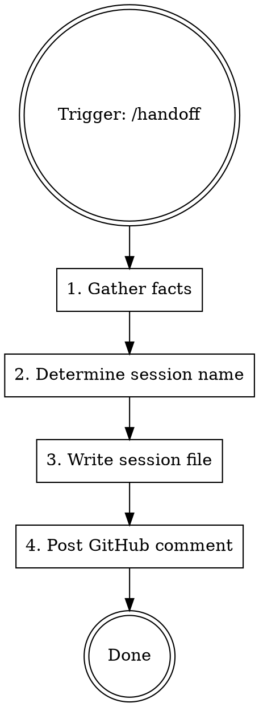

# Session Handoff (SAVE)

Save development session state for later resumption. Write session file, post GitHub comment, preserve traceability.

**Paired with:** `h2t:dev-session-start` (LOAD at start) — this skill is SAVE at end.

**When to SAVE:** End of work session, context window nearing limits, switching to different task.

## Procedure



### Step 1: Gather Facts (DO NOT HALLUCINATE)

**CRITICAL: Only write what you can verify.** Run these commands:

```bash
git remote get-url origin 2>/dev/null   # repo
git branch --show-current               # branch
git log --oneline -1                    # last commit
git status --short                      # uncommitted changes
```

**Scope:** "What Was Done" describes THIS SESSION only. Use conversation context, not `git diff HEAD~N`.

Read the TodoWrite task list if it exists. Check for open tasks.

### Step 2: Determine Session Name

If `SESSION_NAME` was set during `h2t:dev-session-start`, use it.

If not (session started without `/session-start`), derive from:
- Current branch name, OR
- Primary issue worked on, OR
- Ask user: "Как назвать эту сессию? Предлагаю: `{slug}`"

Format: `{task-slug}-{YYYY-MM-DD}` (e.g., `phase5-blocktype-2026-03-11`)

### Step 3: Write Session File

**Location:** `<memory_dir>/sessions/{session-name}.md`

Create `sessions/` directory if it doesn't exist.

```markdown
# Session: {session-name}

## Meta
- **Date:** YYYY-MM-DD
- **Branch:** {branch}
- **Last commit:** {hash} {message}
- **Uncommitted:** {yes/no, list if yes}
- **Issues:** #{N}, #{M}
- **Session ID:** {extracted from jsonl path}
- **Resume:** `claude --resume {session-id}`

## What Was Done
- {completed item 1}
- {completed item 2}

## What Remains
- [ ] {next task 1}
- [ ] {next task 2}

## Key Decisions
- {decision}: {rationale}

## Critical Context
{anything the next session MUST know to avoid mistakes}
```

### Rules

- **Max 60 lines.** Handoff is a summary, not a journal.
- **No duplication.** Don't repeat CLAUDE.md or MEMORY.md. Reference them.
- **Verify before writing.** Every path, hash, value must come from a tool call.
- **Uncommitted work is critical.** List every modified file from `git status`.
- **Remaining tasks are actionable.** Specific enough to start immediately.
- **Include issue numbers.** Every task links to a GitHub issue.

### Step 4: Post GitHub Comment

For each issue worked on in this session:

```bash
# Extract session ID
MEMORY_DIR="<memory_dir>"
PROJECT_DIR=$(dirname "$MEMORY_DIR")
SESSION_ID=$(basename $(ls -t "$PROJECT_DIR"/*.jsonl 2>/dev/null | head -1) .jsonl 2>/dev/null)

gh issue comment {NUMBER} --body "🤖 Handoff: {session-name}
Resume: claude --resume ${SESSION_ID}
File: memory/sessions/{session-name}.md
Status: {brief — what's done, what remains}"
```

If context ran out (not end of work), note in comment:
```
Status: Context limit reached. Work continues in next session.
```

### Step 4.5: Close Session in Registry

If `$DOR_SESSION_ID` is available, close the session in the registry:

```bash
CONFIG_ROOT="${DOR_CONFIG_ROOT:-$HOME/config}"
[ ! -d "$CONFIG_ROOT" ] && [ -d "/c/dev/config" ] && CONFIG_ROOT="/c/dev/config"
REGISTRY_PY="$CONFIG_ROOT/registry/registry.py"

if [ -f "$REGISTRY_PY" ] && [ -n "${DOR_SESSION_ID:-}" ]; then
  python3 "$REGISTRY_PY" update \
    --id "$DOR_SESSION_ID" \
    --status "done" \
    --summary "{one-line summary of what was accomplished}"
fi
```

For interrupted sessions (context limit, not end of work):
```bash
  python3 "$REGISTRY_PY" update \
    --id "$DOR_SESSION_ID" \
    --status "interrupted" \
    --summary "{what remains}"
```

If `$DOR_SESSION_ID` is not set, skip this step silently.

## Session ID Extraction

```bash
MEMORY_DIR="<memory_dir>"
PROJECT_DIR=$(dirname "$MEMORY_DIR")
SESSION_ID=$(basename $(ls -t "$PROJECT_DIR"/*.jsonl 2>/dev/null | head -1) .jsonl 2>/dev/null)
```

## Migration from Legacy

If `<memory_dir>/handoff.md` exists from old format:
1. Read it
2. Create `sessions/` directory
3. Move content to `sessions/{derived-name}.md`
4. Delete `handoff.md`

## Common Mistakes

| Mistake | Fix |
|---------|-----|
| Writing values from memory | Run `git status`, `git log` first — verify everything |
| 100+ line handoff | Cut to 60 max. Reference docs, don't repeat |
| Vague remaining tasks | Be specific: "Implement blockType field (#38)" not "continue work" |
| Missing issue numbers | Every task and decision links to an issue |
| Forgetting GitHub comment | Traceability is lost — always post handoff comment |
| Overwriting existing session file | Check if file exists, append date suffix if needed |
| Including previous session work | "What Was Done" = THIS session only |
