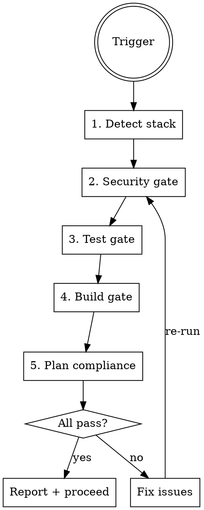

# Pre-Merge Check

Quality gate before merge to main. Runs security audit, tests, build, and validates against plan.

## When to Use

- Before `git merge` to main
- Before creating a PR
- When `superpowers:finishing-a-development-branch` is invoked

## Procedure



### Step 1: Detect Stack

Auto-detect from project files (same logic as `h2t:dev-session-start` Step 4).
Check CLAUDE.md for `## Stack Config` override.

Determine commands:
- **JS/TS:** `npm audit`, `npx playwright test` or `npm test`, `npm run build`
- **Python:** `pip-audit`, `pytest`, `ruff check`, build command from pyproject.toml
- **Rust:** `cargo audit`, `cargo test`, `cargo clippy`, `cargo build --release`

### Step 2: Security Gate

```bash
{audit_command}  # npm audit / pip-audit / cargo audit
```

Check project `.claude/rules/security.md` if it exists — run through ESSENTIAL items:
- [ ] No hardcoded secrets in diff
- [ ] Path parameters validated in new routes
- [ ] Input validation on new endpoints
- [ ] CORS not widened

```bash
git diff main...HEAD -- '*.js' '*.ts' '*.py' | grep -i -E "(api_key|secret|password|token)" || echo "No secrets found"
```

**FAIL if:** critical/high vulnerabilities in audit, or secrets in diff.

### Step 3: Test Gate

```bash
{test_command}  # npx playwright test / pytest / cargo test
```

**FAIL if:** any test fails. Zero tolerance for flaky — investigate, don't retry blindly.

### Step 4: Build Gate

```bash
{build_command}  # npm run build / cargo build --release
```

**FAIL if:** build errors or warnings treated as errors.

### Step 5: Plan Compliance

If a plan file exists for this work (check `docs/plans/`):
1. Read the plan
2. Verify each task is implemented
3. Flag any skipped tasks

If no plan exists, skip this step.

### Report

Present results as a table:

```markdown
## Pre-Merge Check Results

| Gate | Status | Details |
|------|--------|---------|
| Security | PASS/FAIL | {audit output summary} |
| Tests | PASS/FAIL | {N passed, M failed} |
| Build | PASS/FAIL | {clean / errors} |
| Plan | PASS/SKIP | {N/M tasks complete} |

**Verdict:** READY TO MERGE / BLOCKED
```

If all pass → proceed with merge/PR.
If any fail → list specific failures, suggest fixes.

## Common Mistakes

| Mistake | Fix |
|---------|-----|
| Skipping audit for "small changes" | Every merge gets full check. No exceptions. |
| Retrying flaky tests | Investigate root cause, don't retry. |
| Ignoring build warnings | Warnings may become errors. Fix them. |
| Running wrong test command | Auto-detect stack first, check Stack Config. |
