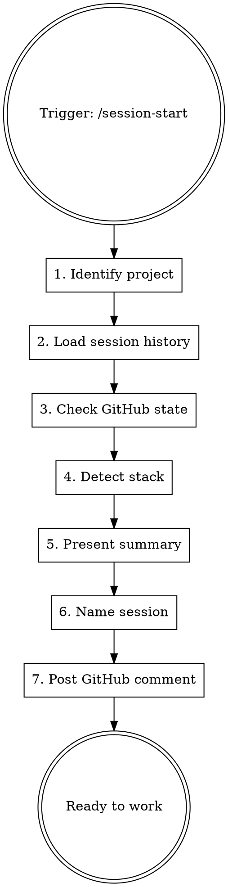

# Dev Session Start

Load project context, show active work across sessions, and prepare for focused development.

**Paired with:** `h2t:handoff` (SAVE at end) — this skill is LOAD at start.

## When to Use

- Starting a new coding/product session
- Resuming work after a break
- Switching to a different project

**NOT for:** personal OS, management, psychology, non-dev conversations.

## Procedure



### Step 1: Identify Project

```bash
git remote get-url origin 2>/dev/null   # → repo name
git branch --show-current               # → current branch
git log --oneline -5                    # → recent commits
git status --short                      # → uncommitted work
```

Extract `owner/repo` from remote URL for `gh` commands.

### Step 2: Load Session History

Read ALL files in `<memory_dir>/sessions/`:

```bash
ls <memory_dir>/sessions/*.md 2>/dev/null
```

For each file: extract task name, date, branch, "What Remains".
Build a **session map**: which tasks are active, which branches have in-flight work.

Also read `<memory_dir>/MEMORY.md` for stable lessons.

If no `sessions/` dir exists, check legacy `<memory_dir>/handoff.md`.

If neither exists (first session ever), skip to Step 3 — there's no history yet.

### Step 3: Check GitHub State

Extract `{owner}/{repo}` from Step 1 remote URL. Run in parallel:

```bash
gh api repos/{owner}/{repo}/milestones --jq '.[] | select(.state=="open") | {title, open_issues}'
gh issue list --state open --label "priority:P0" --json number,title,labels --limit 20
gh issue list --state open --label "bug" --json number,title --limit 10
gh pr list --state open --json number,title,headRefName
```

Pick the milestone with most open issues as "current". Then load its tasks:

```bash
gh issue list --milestone "<current milestone title>" --state open --json number,title,labels
```

### Step 4: Detect Stack

Auto-detect from project files:

| File | Stack |
|------|-------|
| `package.json` | JS/TS → `npm test`, `npm audit`, `npm run build` |
| `pyproject.toml` | Python → `pytest`, `pip-audit`, `ruff check` |
| `Cargo.toml` | Rust → `cargo test`, `cargo audit`, `cargo clippy` |
| `go.mod` | Go → `go test`, `govulncheck` |

Check CLAUDE.md for `## Stack Config` override section. If present, use those commands instead.

### Step 5: Present Summary

Show the user a structured overview:

```markdown
## 🔧 Project: {repo-name} ({branch})

**Stack:** {detected stack}
**Milestone:** {current milestone} — {open}/{total} issues

### Active Sessions
| Session | Branch | Last Date | Status |
|---------|--------|-----------|--------|
| {task-slug} | {branch} | {date} | {remains count} tasks left |

### Priority Tasks (current milestone)
- P0: #38 Add blockType field, #39 technology field...
- P1: #41 Markdown preview...
- Bugs: #43 selection lost, #44 glow lost

### Uncommitted Work
{git status output if any}

### Open PRs
{pr list if any}
```

Ask: **"Продолжить с задачей X, или другое направление?"**

### Step 6: Name Session

Propose a session slug derived from the chosen task:

```
Предлагаю имя сессии: `phase5-blocktype` (из issue #38)
Корректируй если нужно.
```

User confirms or edits. Store as `SESSION_NAME` for this conversation.

### Step 7: Post GitHub Comment + Record Session

If working on a specific issue:

```bash
# Get session ID from newest jsonl file
SESSION_ID=$(basename $(ls -t ~/.claude/projects/*/$(basename $(pwd))/*.jsonl 2>/dev/null | head -1) .jsonl 2>/dev/null)

gh issue comment {NUMBER} --body "🤖 Session: {SESSION_NAME}-{DATE}
Resume: claude --resume ${SESSION_ID}
Handoff: memory/sessions/{SESSION_NAME}-{DATE}.md"
```

Create TodoWrite tasks from chosen work items.

### Step 7.5: Update Session Registry

If `$DOR_SESSION_ID` is available (set by SessionStart hook), update the registry with session context:

```bash
CONFIG_ROOT="${DOR_CONFIG_ROOT:-$HOME/config}"
[ ! -d "$CONFIG_ROOT" ] && [ -d "/c/dev/config" ] && CONFIG_ROOT="/c/dev/config"
REGISTRY_PY="$CONFIG_ROOT/registry/registry.py"

if [ -f "$REGISTRY_PY" ] && [ -n "${DOR_SESSION_ID:-}" ]; then
  python3 "$REGISTRY_PY" update \
    --id "$DOR_SESSION_ID" \
    --status "active" \
    --session-name "{SESSION_NAME}" \
    --topic "{user-provided topic}" \
    --task-issue "#{NUMBER}" \
    --task-title "{issue title}"
fi
```

If `$DOR_SESSION_ID` is not set, skip this step silently. The session was already registered by the hook — this step enriches it.

## Session ID Extraction

The Claude session ID is the filename (without `.jsonl`) of the newest transcript in the project memory directory:

```bash
# Find the project memory dir (shown in system prompt as "auto memory directory")
# Then go up one level to find .jsonl files:
MEMORY_DIR="<memory_dir>"  # from system prompt
PROJECT_DIR=$(dirname "$MEMORY_DIR")
SESSION_ID=$(basename $(ls -t "$PROJECT_DIR"/*.jsonl 2>/dev/null | head -1) .jsonl 2>/dev/null)
```

If no `.jsonl` files found (e.g., first session), skip session ID — note this in the GitHub comment.

Use this for `claude --resume {session-id}` references.

## Stack Config Override (in project CLAUDE.md)

If auto-detect is insufficient, project CLAUDE.md can contain:

```markdown
## Stack Config
- test: npx playwright test
- build: npm run build
- audit: npm audit
- lint: eslint .
```

Skill reads this section and uses these commands for pre-merge checks and verification.

## Common Mistakes

| Mistake | Fix |
|---------|-----|
| Skip reading session history | ALWAYS read `sessions/` dir — other sessions may have context |
| Forget to post GitHub comment | Traceability is lost — always post session start comment |
| Assume single active session | User may have 2-3 parallel sessions — show ALL active work |
| Hardcode JS commands for Python project | Auto-detect stack first, or read Stack Config |
| Start coding without naming session | Name first — handoff file path depends on it |
| Guess session ID | Extract from actual jsonl file path, never fabricate |
